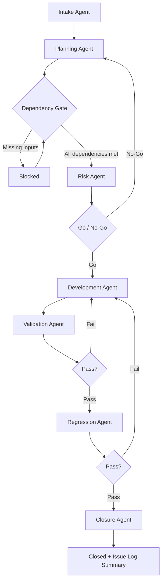

# LifePRO → QLAdmin Issue Resolution Framework

**Version:** 1.0  
**Project:** Warrenhughes1974 / QLA Migration  
**Scope:** Gated issue log remediation — no code until approved  

---

## Purpose

Every issue log item must pass through the same **gated process** before production conversion logic changes. This framework prevents:

- Coding before source data or field definitions are confirmed
- Broad refactors that break stable conversions
- Missing validation/regression evidence
- Unresolved client questions shipped as assumptions

**Hard rule:** Follow `AGENTS.md` enterprise conversion rules at all times. Surgical edits only.

---

## Overall Workflow

### Linear stage order

| Stage | Agent | Code allowed? |
|-------|--------|---------------|
| 1 | Intake | **No** |
| 2 | Planning | **No** |
| 3 | Dependency Gate | **No** |
| 4 | Risk | **No** |
| 5 | Development | **Yes** (surgical only) |
| 6 | Validation | Read-only + scripts |
| 7 | Regression | Read-only + batch/compare |
| 8 | Closure | Docs only |

---

## Required Decision Gates

| Gate | Location | Pass criteria |
|------|----------|---------------|
| **G0 — Intake complete** | After Intake | Issue scoped, artifacts listed, severity/owner assigned |
| **G1 — Planning complete** | After Planning | Source/target mapping documented, open questions listed |
| **G2 — Dependencies satisfied** | Dependency Gate | No blockers on source files, client answers, field defs, screenshots |
| **G3 — Risk approved** | Risk Agent | Go/conditional-go with quantified impact; fallback rules defined |
| **G4 — Development complete** | Development | Surgical diff, version bump if `app.py`, validation script added |
| **G5 — Validation pass** | Validation | Trace policies, field alignment, row counts per test plan |
| **G6 — Regression pass** | Regression | Unrelated tables/fields unchanged; no schema drift |
| **G7 — Closure** | Closure | Issue-log-ready resolution summary published |

**Development cannot begin until G1 + G2 + G3 are satisfied.**

---

## Issue Statuses

Use these statuses in issue tracking sheets and report headers:

| Status | Meaning | Next action |
|--------|---------|-------------|
| **Intake** | Issue received; not yet analyzed | Run Intake Agent |
| **Planning** | Research and mapping in progress | Run Planning Agent |
| **Blocked — Awaiting Client Data** | Missing LifePRO extract, re-pull, or file delivery | Dependency Gate; client action |
| **Blocked — Awaiting Client Clarification** | Business rule, target field, or scope undefined | Dependency Gate; client Q&A |
| **Ready for Risk Review** | Planning done; dependencies clear | Run Risk Agent |
| **Ready for Development** | Risk go/conditional-go approved | Run Development Agent |
| **In Development** | Code/rulebook changes in progress | Complete dev + self-check |
| **Ready for Validation** | Dev complete; awaiting proof | Run Validation Agent |
| **Ready for Client UAT** | Validation + regression pass | Client QLAdmin review |
| **Closed** | Resolution summary published | Archive artifacts |

---

## Framework Rules (Non-Negotiable)

1. **No code changes** during Intake, Planning, Dependency Gate, or Risk stages.
2. **Development cannot begin** until Planning and Risk are complete (G1 + G3).
3. If **source data, client clarification, field definitions, or screenshots** are missing, **stop at Dependency Gate**.
4. All code changes must be **surgical and issue-specific** — no wholesale rewrites.
5. Every development change must include **validation and regression evidence**.
6. Every issue must end with an **issue-log-ready resolution summary** (Closure Agent).
7. **Preserve prior fixes:** Issue #25 MPOLICY padding (`format_qladmin_mpolicy`) and Issue #26 MPREM mapping (`ANN_PREM_PER_UNIT` + fallback) must not regress.

---

## Artifact Locations

| Artifact type | Typical path |
|---------------|--------------|
| Issue deliverables | `Issue_Log_Items/Issue_<NN>/` or `Issue_<NN><Letter>/` |
| Research scripts | `QLA_Migration/_research_issue*.py`, `_validate_issue*.py` |
| Rulebooks | `QLA_Migration/Configs/Sync_Rulebook_*.csv` |
| Crosswalk | `QLA_Migration/Mapping/Master_Crosswalk.csv` |
| Source extracts | `QLA_Migration/Source/` |
| Conversion output | `QLA_Migration/Output/` |
| Agent prompts | `AI_Agents/*.md` |
| Templates | `AI_Agents/Templates/` |

---

## Examples by Issue

### Issue #25 — MPOLICY fixed-width padding

| Stage | Outcome |
|-------|---------|
| Intake | Client: QLAdmin "Policy Not Found" for short policy keys |
| Planning | Target: 10-char left-pad on MPOLICY across quik* tables |
| Dependency Gate | Crosswalk + output CSV verified; no client blocker |
| Risk | Low blast radius; DBF `.strip()` on load noted as separate concern |
| Development | `format_qladmin_mpolicy()` in `qla_core/normalize_utils.py`; v57.30 |
| Validation | `_validate_mpolicy_width.py` — 279k fields, 0 short |
| Regression | Row counts unchanged; only MPOLICY width |
| Closure | Issue #25 resolved; padding preserved for all future issues |

**Lesson:** Display/locate failures may be CSV vs DBF load — plan DBF path separately if needed.

---

### Issue #26 — MPREM annual premium per unit

| Stage | Outcome |
|-------|---------|
| Intake | Prem/Unit on Coverage tab wrong; client values match modal premium |
| Planning | QLAdmin Help: `MPREM` = annual premium per unit → `ANN_PREM_PER_UNIT` |
| Dependency Gate | PPBEN extract available; QLAdmin field def confirmed |
| Risk | 3,718 rows change; fallback for blank ANN (`MODE_PREMIUM`); MMODPREM untouched |
| Development | Rulebook + engine fallback; v57.31; `_validate_issue26_mprem.py` |
| Validation | Trace policies 13.20 / 10.96 / 9.12; MMODPREM unchanged |
| Regression | quikprmh, MVPU, MUNIT, row counts unchanged |
| Closure | MPREM fix documented; modal premium remains on quikmstr |

**Lesson:** Always run Planning + Risk before mapping changes that touch premium semantics.

---

### Issue #21M — QUIKMEMO / Policy Notes / ENS

| Stage | Outcome |
|-------|---------|
| Intake | Notes/ENS not converted; no quikmemo rulebook |
| Planning | Target QUIKMEMO (`MEMOKEY` + `MEMOTEXT`); sources PNOTE + PENSE cited |
| Dependency Gate | **BLOCKED** — PNOTE/PENSE not in Source/ package |
| Risk | Not started (awaiting extracts) |
| Development | **No-Go** |
| Validation | — |
| Regression | — |
| Closure | Pending |

**Lesson:** New-table builds stop at Dependency Gate until LifePRO delivers extracts.

---

## How to Run

1. Open `AI_Agents/Run_Issue_Framework_Prompt.md`
2. Paste your issue description
3. Instruct Cursor: *"Run the Issue Resolution Framework. Start with Intake and Planning only. Do not code unless explicitly approved."*
4. Advance stage-by-stage; do not skip gates

---

## Related Documents

- `AGENTS.md` — Enterprise conversion guardrails
- `AI_Agents/Dependency_Gate.md` — Blocker checklist
- `AI_Agents/Templates/` — Report templates
- `Issue_Log_Items/Issue_Log_Master_Tracking_Sheet.md` — Master issue index
