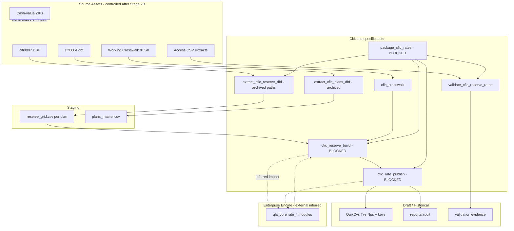

# Current-State Pipeline (Discovered)

**Status:** Inferred from migrated Citizens assets — Stage 3  
**Do not treat as approved target architecture.**

## Summary

The legacy CFIC workflow is a **reserve-wave packaging pipeline** with optional extract/validate steps, plus separate pilots for PDF gross premium and green-sheet OCR. Paths and layout still assume the pre-migration `CFIC_Rates` tree. Enterprise rate emit depends on external `qla_core`.

## Discovered Sequence (Reserve Wave)

| Step | Script (migrated location) | Inputs | Outputs | Maturity |
|------|---------------------------|--------|---------|----------|
| 1. Source registration | *(manual)* | Client DBFs/ZIPs/PDFs | `source/` after Stage 2B | Partial |
| 2. Reserve extract | `archive/.../extract_cfic_reserve_dbf.py` | `cifi0007.DBF` | per-plan `reserve_grid.csv` | Working (archived paths) |
| 3. Plans extract | `archive/.../extract_cfic_plans_dbf.py` | `cifi0004.dbf` | `plans_master.csv` | Working (archived paths) |
| 4. Crosswalk load | `archive/.../cfic_crosswalk.py` | Crosswalk XLSX | In-memory plan→QLPlan | Working mapping |
| 5. Validate (pilot) | `archive/.../validate_cfic_reserve_rates.py` | Staging + Access CSV | Evidence CSV | P7MN only |
| 6. Build grids | `conversion/orchestration/cfic_reserve_build.py` | Staging + `qla_core` | Factor/key/member structures | **Blocked by engine + paths** |
| 7. Publish CSVs | `conversion/orchestration/cfic_rate_publish.py` | Built structures + `qla_core.rate_dbf_writer` | Quik*.csv | **Blocked** |
| 8. Orchestrate | `conversion/orchestration/package_cfic_rates.py` | CLI args | Calls 2–7 | **Blocked — DO NOT RUN** |
| 9. Assumptions template | `build_cfic_assumption_template.py` | QuikPlCv/Tv | OBQ-2 CSV | Not ready |

## Parallel / Historical Branches (Not Current Authority)

| Branch | Scripts | Status |
|--------|---------|--------|
| Green-sheet OCR | Issue 01 extract/validate | Pilot **FAIL** — DO_NOT_EXECUTE as authority |
| PDF gross premium | Issue 02 extract/emit | Pilot only — BLOCKED_BY_ENGINE |
| Tracker rebuild | `_build_rate_load_tracker.py` | Diagnostic — NOT_READY |

## Inferred vs Confirmed

| Relationship | Status |
|--------------|--------|
| DBF → reserve staging → QuikCvs/Tvs/Nps | **Confirmed** by Issue 03 notes + draft outputs |
| Access CSV as validation checkpoint | **Confirmed** for P7MN |
| Gross premium in reserve DBF | **Confirmed absent** (deferred) |
| OCR as CV authority | **Rejected** by discovery (DBF preferred) |
| Full 308-plan publish readiness | **Inferred incomplete** (OBQ blockers) |

## Side Effects / Failure Behavior

- Orchestrator uses `subprocess.run(..., check=True)` — fails hard on extract/validate errors
- Publish can clean legacy `output/rates` (case-folder debt)
- Validation currently gates only P7MN checkpoint, not full fleet
- **Idempotency:** re-publish overwrites Quik CSVs (unsafe without run_manifest)
- **Restart:** partial — can skip extract with flags; not formally checkpointed
- **Audit:** `emit_summary.json`, `rate_csv_manifest.csv` (historical under `reports/audit/`)

## Maturity Assessment

| Capability | Maturity |
|------------|----------|
| Source custody (post-2B) | Controlled |
| Path/config abstraction | **Absent** |
| Engine boundary | **Documented only** |
| Stage gates | **Absent** in orchestrator |
| Full reconciliation | **Absent** |
| Production publish | **Blocked** |

## Mermaid — Current State (Inferred)

Dashed lines = inferred dependency / not currently runnable from Citizens layout.
