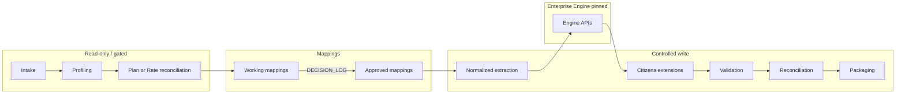

# Target-State Pipeline

**Status:** Proposed architecture — Stage 3  
**Not implemented.**

## Principles

1. Separate **read-only** discovery from **write** conversion.
2. Require **source authority** + **approved mapping** before Development emit.
3. Call **Enterprise Engine** only through a pinned interface.
4. Keep Citizens-specific logic in `conversion/client_extensions/`.
5. Never write into `source/original/` or `mappings/approved/` from runtime.
6. No CSO assumptions.

## Pipeline Stages

| # | Stage | Mode | Gate |
|---|-------|------|------|
| 1 | Intake | Read/docs | Issue approved |
| 2 | Source registration | Write manifests | Hash verified |
| 3 | Source profiling | Read/write reports | Profile complete |
| 4 | Plan-universe reconciliation | Write plan_manifest | Client/internal review |
| 5 | Rate-type classification | Write rate catalog | Authority assigned |
| 6 | Working mapping | Write mappings/working | Peer review |
| 7 | Mapping approval | Promote copy to approved | DECISION_LOG |
| 8 | Normalized extraction | Write staging | Source authority |
| 9 | Enterprise Engine transformation | Engine call | Engine version pin |
| 10 | Citizens extensions | Write staging/output draft | Scope gate |
| 11 | Validation | Write validation/ | Pass criteria |
| 12 | Reconciliation | Write reports | RECONCILED |
| 13 | Regression | Compare golden | No non-candidate drift |
| 14 | Packaging | Write release_packages | Delivery manifest |
| 15 | UAT delivery | External | Client sign-off |
| 16 | Release | Tag/record | Release authority |

## Where Configuration Applies

- Paths, enablement, fail-on-* flags: before steps 8–14
- Environment overlays: local vs validation vs production

## Where Engine Is Called

- Step 9 primarily (factor grids, keys, members, schema formatting, writers)
- Optional validation helpers if exposed as Engine APIs

## Mermaid — Target State

## Relation to Current Scripts

| Legacy script | Target fate |
|---------------|-------------|
| `package_cfic_rates.py` | Replace with gated orchestrator (CIT-ARCH-005) |
| `cfic_reserve_build.py` / `cfic_rate_publish.py` | Thin Citizens wrappers around Engine APIs |
| `legacy_cfic_paths.py` | Delete after config migration |
| Issue 01 OCR extract | Remain historical; never authority |
| Issue 02 PDF emit | Future CIT-RATE gross-premium issue |
| Stage 2A/2B tools | Retain as tooling |
