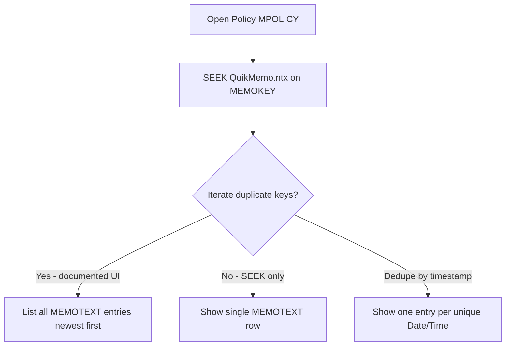

# Issue 21M-FU — Multiple Memo Display Research Report

**Issue:** QLAdmin Memo tab shows one memo; QUIKMEMO has multiple rows per policy  
**Framework stage:** Planning Agent (Stage 2) — research only, no code  
**Engine version:** v57.33  
**Generated:** 2026-06-24  
**Primary trace policy:** `010335038C`

---

## 1. Executive Finding

Conversion output for policy **010335038C** is **correct at the DBF/DBT layer**: two PNOTE source rows map to **two QUIKMEMO rows** with matching `MEMOKEY`, and **both `MEMOTEXT` blobs are readable** from `quikmemo.dbf` + `quikmemo.dbt`. The defect is **not** a missing conversion row or broken memo pointer for this policy.

The most likely root cause is **QLAdmin read behavior on duplicate `MEMOKEY` values** — either (a) the Memo tab positions on the `QuikMemo.ntx` index once via `SEEK` and does not iterate duplicate keys, or (b) the UI deduplicates list entries when converted memos share the same embedded Date/Time stamp. QLAdmin Help **documents** a multi-memo UI (“most recent memos are listed first”) and a **non-unique** index on `MEMOKEY` only, which **conflicts** with the UAT observation unless the runtime read path differs from documented design.

**Recommendation:** **Do not change QUIKMEMO output yet.** Complete a short **client UAT probe** (native two-memo test + confirm which converted memo displays). Then route to Risk Agent for concatenation vs multi-row remediation.

---

## 2. QLAdmin Help and Schema Findings

### 2.1 Table definition (Help §7.151)

Source: `claims_analysis/phase17_uat_governance_reporting/_qladmin_table_defs.txt` (PDF page 841)

| Field | Type | Length | Description |
|-------|------|--------|-------------|
| **MEMOKEY** | CHARACTER | 10 | Policy number |
| **MEMOTEXT** | MEMO | 10 | Policy memo |

| Index | Key expression | Documented UNIQUE? |
|-------|----------------|-------------------|
| **QuikMemo.ntx** | `MEMOKEY` | **No** |

**No secondary sequence, date, or user columns** exist in `QUIKMEMO`. Any ordering metadata must live **inside `MEMOTEXT`** (consistent with Issue 21M design).

### 2.2 Memo tab UI (Help §5.1.1.4)

Source: `claims_analysis/phase17_uat_governance_reporting/_qladmin_pdf_extract.txt` (PDF page 56)

| Help statement | Implication |
|----------------|-------------|
| “Policy memos can be **added** as needed” | Multiple memos per policy expected over time |
| “The **most recent memos are listed first**” | UI lists **plural** memos, sorted by recency |
| “QLAdmin records the date…” (truncated in extract) | Date/time/user stored **in the memo stream**, not separate columns |
| Sys-Op can edit/delete memos; Print Memo prints **memo history** | History implies multiple entries |

**Note:** Prior 21M research cited §5.1.4.1.6; the PDF extract indexes the same content under **§5.1.1.4 Memo Tab** (page 56). Wording supports **multiple rows per policy**, not one concatenated blob.

### 2.3 Index files (.ntx)

| Finding | Detail |
|---------|--------|
| Conversion package | **Does not ship** `QuikMemo.ntx` — QLAdmin rebuilds indexes on deploy (`QLA_Migration/QLAdmin_Converted_Tables.txt` classifies `.ntx` as index orders, not extract targets) |
| Repo | **Zero** `.ntx` files present for inspection |
| FoxPro semantics (general) | Non-unique index: `SEEK` positions on **first** matching key in index order; additional matches require `SKIP` loop while key still matches |

### 2.4 Production / template examples in repo

| Search | Result |
|--------|--------|
| Native `quikmemo.dbf` from live QLAdmin | **Not found** in repository |
| Claims prototype DBF writers | Handle `MEMOTEXT` MEMO type for **QUIKCLMS**, not policy memos |
| Pre-21M conversion | QUIKMEMO was never emitted before v57.32 |

**Gap:** Cannot compare converted multi-row layout to a known-good production `QUIKMEMO` without client-provided reference.

---

## 3. Policy 010335038C — DBF/DBT Trace

**Artifacts:**

- `Issue_Log_Items/Issue_21M/Issue_21M_010335038C_DBF_DBT_Trace.csv`
- `Issue_Log_Items/Issue_21M/Issue_21M_010335038C_Source_Trace.csv`

### 3.1 LifePRO source (PNOTE)

| Item | Value |
|------|-------|
| LifePRO policy (LP) | `9010335038` (crosswalk `New_Value` → `Old_Value`) |
| QLA / MEMOKEY | `010335038C` |
| PNOTE source rows | **2** |

### 3.2 QUIKMEMO output (CSV and DBF)

| Row | Physical recno | Seq | MEMOTEXT (summary) | Len |
|-----|----------------|-----|-------------------|-----|
| 1 | 198 | 2 | `5/18/18 - LETTER & CHECK MAILED TO PB.` | 104 |
| 2 | 199 | 1 | `PB = PATSY MILLER` + `5/1/18 - PROOF OF DEATH TO PB.` | 114 |

Both rows:

- `MEMOKEY` = `'010335038C'` (10 chars, no leading-space padding on this policy)
- Header: `[PNOTE]`
- **Same embedded Date/Time:** `2018-05-18` / `08:45:28` (copied from LifePRO source batch timestamp, not distinct per seq)

### 3.3 DBF/DBT integrity

| Check | Result |
|-------|--------|
| `quikmemo.dbf` row count for policy | **2** |
| `quikmemo.dbt` sidecar | **Present** (14,990,916 bytes) |
| `quikmemo.fpt` | Not present (QLAdmin/FoxPro memo via **DBT** for this build) |
| Python `dbf` library read both MEMOTEXT | **PASS** — full text for both rows |
| CSV vs DBF row parity | **PASS** — 2 rows each |

**Hypothesis 5 (DBF/DBT unreachable): RULED OUT** for this policy.

---

## 4. Multi-Memo Policy Sample Report

**Artifact:** `Issue_Log_Items/Issue_21M/Issue_21M_Multi_Memo_Policy_Samples.csv`

### 4.1 Fleet population (v57.33 `quikmemo.csv`)

| Metric | Value |
|--------|------:|
| Total QUIKMEMO rows | 29,279 |
| Unique MEMOKEY | 4,380 |
| MEMOKEYs with ≥ 2 rows | **3,466 (79.1%)** |
| Extra rows beyond first per key | 24,899 |
| Max rows per policy | 207 (`010785099C`) |
| Avg rows per policy | 6.68 |

### 4.2 Trace set (client + framework policies)

| QLA policy | Total rows | PNOTE | PENSE | Notes |
|------------|----------:|------:|------:|-------|
| **010335038C** | 2 | 2 | 0 | **Defect example** — identical Date/Time on both rows |
| 010713704C | 2 | 1 | 1 | Different source types; different dates |
| 010818663C | 3 | 3 | 0 | Two rows share `2011-08-23 15:43:11` |
| 010765930C | 2 | 1 | 1 | Mixed PNOTE + PENSE |
| 010391876C | 2 | 0 | 2 | PENSE-only pair |
| 010448806C | 1 | 0 | 1 | **Single-memo** control |
| 010718309C | 1 | 1 | 0 | **Single-memo** control |
| 010391895C | — | — | — | Not in current output (no memos or no crosswalk) |

If QLAdmin truly shows **only the first index hit** per `MEMOKEY`, the impact is **fleet-wide**, not limited to `010335038C`.

---

## 5. Hypothesis Evaluation (Client Research Brief)

| # | Hypothesis | Verdict | Evidence |
|---|------------|---------|----------|
| **1** | QLAdmin displays only the **first** (or **last**) QUIKMEMO row per MEMOKEY | **PRIMARY — likely** | UAT shows 1 of 2 rows; FoxPro `SEEK` on non-unique index returns one record; 79% of keys are multi-row |
| **2** | QUIKMEMO index requires **unique** MEMOKEY | **Unlikely** | Help does not mark index UNIQUE; DBF still contains duplicate keys after client inspection |
| **3** | Missing **secondary sequence/date key** column | **Design constraint, not defect** | Schema has only two fields; Help says metadata lives in memo stream — matches 21M implementation |
| **4** | Memos must be **concatenated** into one MEMOTEXT per policy | **Possible workaround — not proven** | Help describes plural “memos listed”; concatenation contradicts native add/edit/delete semantics unless vendor confirms |
| **5** | DBF/DBT issue — second memo text not reachable | **RULED OUT** | Both blobs read successfully from deployed DBF+DBT |
| **6** | Incorrect **NTX rebuild** drops duplicates | **Unconfirmed** | No NTX in conversion output; client still sees 2 DBF rows — dedupe would need to happen at **display**, not storage |
| **7** | **Sort/order** — only newest or oldest displays | **Possible subset of #1** | File sorted newest-first globally; for 010335038C, “newest only” would show Seq 2 — **client must confirm visible text** |
| **8** | QLAdmin UI limitation on duplicate MEMOKEY rows | **Likely (same as #1)** | Conflicts with Help unless UI dedupes by embedded timestamp |
| **—** | **Bonus:** UI dedupe by **identical Date/Time** in memo header | **SECONDARY — testable** | 010335038C and 010818663C pairs share identical Date/Time lines; may collapse list even if multi-row scan exists |

### 5.1 How QLAdmin Memo tab likely reads data



**Observed UAT behavior fits `E` or `F`, not `D`.**

---

## 6. Compare QLAdmin Display vs DBF Contents

| Layer | 010335038C |
|-------|------------|
| LifePRO PNOTE | 2 notes (Seq 1, Seq 2) |
| quikmemo.csv | 2 rows |
| quikmemo.dbf + dbt | 2 rows, both MEMOTEXT intact |
| QLAdmin Memo tab (client UAT) | **1** `[PNOTE]` visible |
| **Gap** | **Display layer** — data present, UI does not surface second row |

**Open client question:** Which text appears in QLAdmin — Seq 2 (`LETTER & CHECK MAILED`) or Seq 1 (`PB = PATSY MILLER`)?

---

## 7. Root-Cause Hypothesis (Ranked)

### H1 — Index SEEK without duplicate iteration (Confidence: **High**)

QLAdmin Memo tab opens `QUIKMEMO` ordered on `QuikMemo.ntx`, `SEEK`s `MEMOKEY = MPOLICY`, and binds the UI to the **current record only** without scanning forward while `MEMOKEY` matches.

**Supports:** Single visible memo despite duplicate keys; FoxPro common pattern; fleet-wide multi-row keys.

**Does not explain alone:** Help text describing memo *history* and plural listing — unless another code path is used for user-added memos vs converted bulk load.

### H2 — Timestamp deduplication in UI list (Confidence: **Medium**)

QLAdmin parses `[PNOTE] Date:` / `Time:` lines from `MEMOTEXT` for list sorting and **collapses** entries with identical stamps.

**Supports:** 010335038C both rows share `2018-05-18 08:45:28`; 010818663C has two rows at `2011-08-23 15:43:11`.

**Test:** UAT policy **010713704C** (different dates) — if **both** PNOTE and ENS show, H2 is partial; if still one row, H1 dominates.

### H3 — Conversion format incompatible with list parser (Confidence: **Low–Medium**)

Structured `[PNOTE]` header block may not match what QLAdmin expects for **native** memos (e.g. different line order, delimiter, or memo control characters).

**Test:** Manually add a second memo in QLAdmin on a test policy; compare `MEMOTEXT` shape to converted rows.

---

## 8. Recommended Implementation Approach (Planning Only — Not Approved for Dev)

### Phase A — Client UAT probes (required before any code)

| Step | Action | Pass criteria |
|------|--------|---------------|
| A1 | Confirm visible memo text for `010335038C` | Identifies first vs last vs timestamp-deduped row |
| A2 | Open `010713704C` Memo tab | 1 vs 2 entries (PNOTE + ENS) |
| A3 | Native test: add **two** memos to empty test policy in QLAdmin | Inspect `quikmemo.dbf`: 1 row vs 2 rows; compare `MEMOTEXT` format |
| A4 | Optional: provide production `quikmemo.dbf` snippet with known multi-memo policy | Gold-standard layout reference |

### Phase B — Remediation options (after Phase A)

| Option | Description | When to use |
|--------|-------------|-------------|
| **B1 — Keep one row per source (no change)** | If A3 proves native QLAdmin also stores one row per add but UI still lists history differently | Native parity confirmed |
| **B2 — Concatenate per MEMOKEY** | Merge all PNOTE/PENSE text for a policy into **one** QUIKMEMO row with clear separators (`---`, newline blocks); sort newest segment first | A3 proves **one row per policy** in native DBF **or** vendor confirms SEEK-only read |
| **B3 — Distinct embedded timestamps** | Preserve one row per source but force unique `Time:` (e.g. append `:SS.seq` or use source seq in time field) | A4 proves timestamp dedupe (H2) |
| **B4 — Synthetic MEMOKEY suffix** | e.g. `0103350381` | **Not recommended** — breaks MPOLICY relation unless QLAdmin uses non-exact join |
| **B5 — Vendor / QLAdmin config** | Index rebuild, memo module setting, or defect fix | Native multi-row DBF proves data correct |

**Interim recommendation:** Plan for **B2 or B3** as most likely engineering responses, but **gate on A3** — do **not** default to concatenation without proof.

---

## 9. Risk Assessment — One Row per Memo vs One Row per Policy

| Risk dimension | Keep multi-row (current) | Concatenate per policy |
|----------------|-------------------------|------------------------|
| **UAT display** | **Fails today** (observed) | Likely fixes single-memo symptom if SEEK-only |
| **Help alignment** | Matches “memos listed” | Conflicts with per-memo edit/delete |
| **Data volume** | 29,279 rows; max 207/policy | ≤ 4,380 rows; largest MEMOTEXT could be very large |
| **MEMOTEXT size** | Small per row | One policy ≈ sum of all notes — still within MEMO type limits |
| **Incremental updates** | Can append new source rows | Must re-merge entire policy on re-conversion |
| **Print Memo / history** | May work if UI fixed | Single blob — history format depends on separator design |
| **PNOTE vs PENSE identity** | Preserved via row + prefix | Preserved via `[PNOTE]`/`[ENS]` section headers inside blob |
| **Regression blast radius** | Low if UI fix/vendor | **High** — reverses 21M grain decision; re-validate all 29k rows |
| **Issue #25 / #26** | Unaffected | Unaffected (MEMOKEY still one per policy) |
| **Rollback** | Current state | Revert converter sort/merge logic |

---

## 10. Open Client Questions

1. Which memo text displays for **010335038C** in QLAdmin?
2. How many entries appear for **010713704C** (mixed PNOTE + PENSE)?
3. After manually adding two memos to a **test policy** in QLAdmin, how many `QUIKMEMO` rows exist?
4. Can client supply a **production** `quikmemo.dbf` extract for a policy known to have multiple native memos?
5. Does **Print Memo** on `010335038C` show one or two entries?

---

## 11. Framework Gate — Planning Complete (G1)

- [x] Research report published
- [x] QLAdmin Help / schema documented
- [x] DBF/DBT trace for `010335038C`
- [x] Multi-memo sample report (≥5 multi, ≥2 single controls)
- [x] Root-cause hypothesis and remediation options
- [x] Risk assessment for grain change
- [x] **No code, rulebook, or output changes**

**Next stage:** Dependency Gate → **Risk Agent** (after client answers Phase A probes) → Development only if approved.

---

## 12. Recommended Risk Agent Prompt

```
Risk Agent — Issue 21M-FU: Multiple Memo Display

Read Issue_21M_Multiple_Memo_Display_Research_Report.md and Issue_21M_FollowUp_Intake_Summary.md.

Assess remediation options B2 (concatenate per MEMOKEY) vs B3 (unique timestamps) vs vendor path.
Client UAT answers: [paste when available]

Preserve Issue #25 MEMOKEY padding and Issue #26 MPREM. No code yet.
Deliver Issue_21M_FU_Risk_Report.md with GO/NO-GO/CONDITIONAL GO.
```

---

## Appendix — File References

| File | Purpose |
|------|---------|
| `Issue_21M_010335038C_DBF_DBT_Trace.csv` | Full MEMOTEXT for both DBF rows |
| `Issue_21M_010335038C_Source_Trace.csv` | Matching PNOTE source rows |
| `Issue_21M_Multi_Memo_Policy_Samples.csv` | Multi- and single-memo trace set |
| `QLA_Migration/Output/quikmemo_uat_dbf/quikmemo.dbf` | UAT DBF under test |
| `Issue_21M_Resolution_Summary.md` | Parent 21M closure (v57.33) |
