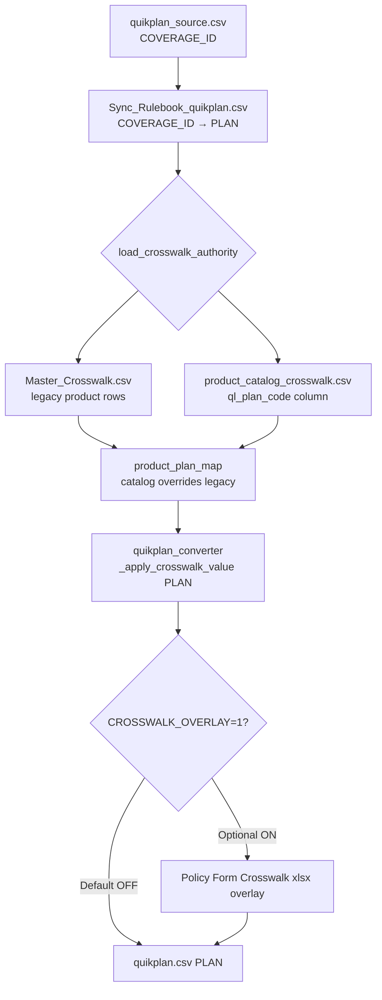
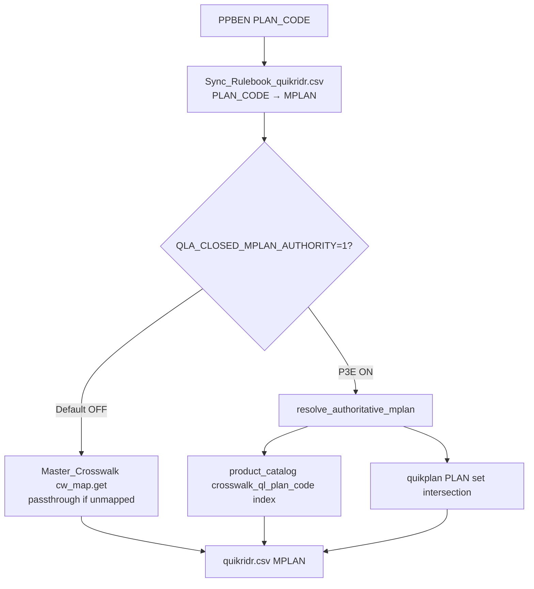

# Issue #28 — Runtime Mapping Flow

**Engine version:** v57.34  
**Intake date:** 2026-06-24

---

## Overview

Plan mapping at batch runtime is a **hybrid, layered system** — not a single crosswalk file. Policy Form Crosswalk 5.22.2026 is **ingested into the product catalog** but **not used as the emit column** in the default batch path.

---

## Flow Diagram — quikplan (PLAN)

---

## Flow Diagram — quikridr (MPLAN)

---

## Authority Precedence — quikplan PLAN

| Priority | Source | Function | Column used |
|----------|--------|----------|-------------|
| 1 (highest) | product_catalog_crosswalk.csv | `load_product_catalog_crosswalk()` | **`ql_plan_code`** |
| 2 | Master_Crosswalk.csv (product rows) | `legacy_product_map` in `load_crosswalk_authority()` | Old_Value → New_Value |
| 3 | Passthrough | Unmapped COVERAGE_ID emitted as PLAN | COVERAGE_ID unchanged |
| Optional overlay | Policy Form Crosswalk xlsx | `apply_crosswalk_overlay()` when `CROSSWALK_OVERLAY=1` | ql_plan_code from xlsx |

**Critical:** `crosswalk_ql_plan_code` (authoritative crosswalk values) is **not** in the precedence chain for default batch emission.

---

## Authority Precedence — quikridr MPLAN

| Mode | Source | Behavior for unmapped PLAN_CODE |
|------|--------|-----------------------------------|
| Default (`QLA_CLOSED_MPLAN_AUTHORITY=0`) | Master_Crosswalk `cw_map` | Passthrough PLAN_CODE as MPLAN |
| P3E enabled | `resolve_authoritative_mplan()` + catalog | Maps to `crosswalk_ql_plan_code` when in quikplan PLAN universe; else UNAUTHORIZED / legacy fallback |

---

## Code Anchors

| Step | File | Lines / symbol |
|------|------|----------------|
| Load layered authority | `qla_core/product_catalog_authority.py` | `load_crosswalk_authority()` — catalog `ql_plan_code` overrides legacy |
| Runtime catalog column selection | `qla_core/product_catalog_authority.py` | `load_product_catalog_crosswalk()` reads **`ql_plan_code`** only |
| quikplan PLAN crosswalk apply | `qla_core/quikplan_converter.py` | `_apply_crosswalk_value()` → `crosswalk_authority.product_plan_map` |
| Batch quikplan path | `app.py` | `convert_quikplan_to_output()` with `cw_authority` |
| xlsx overlay (disabled default) | `qla_core/crosswalk_enrichment.py` | `crosswalk_overlay_enabled()` → `CROSSWALK_OVERLAY` env |
| quikridr MPLAN default | `app.py` | `cw_map.get(val, val)` when P3E off |
| quikridr MPLAN P3E | `app.py` | `resolve_authoritative_mplan()` when `_closed_mplan_authority_enabled()` |

---

## Crosswalk Consumption Summary

| Consumption path | Used at runtime? | Transform |
|------------------|------------------|-----------|
| xlsx → direct overlay | Only if `CROSSWALK_OVERLAY=1` | None — loaded by `load_policy_form_crosswalk()` |
| xlsx → product_catalog_crosswalk.csv | Indirect | Phase P2E/P3C generation; **`crosswalk_ql_plan_code` column** |
| xlsx → Master_Crosswalk.csv | Partial | Only rows that existed in legacy crosswalk; divergent rows often **absent** |
| product_catalog → runtime PLAN | **Yes** | Reads **`ql_plan_code`**, not authoritative column |

---

## Default Batch Path Conclusion

Under v57.34 default flags, the converter emits PLAN/MPLAN from **`product_catalog_crosswalk.csv` → `ql_plan_code`** (compatibility column) with Master_Crosswalk fallback. The Policy Form Crosswalk 5.22.2026 authoritative values in **`crosswalk_ql_plan_code`** are stored but **not consumed** for emission unless overlay or remediation is enabled.
