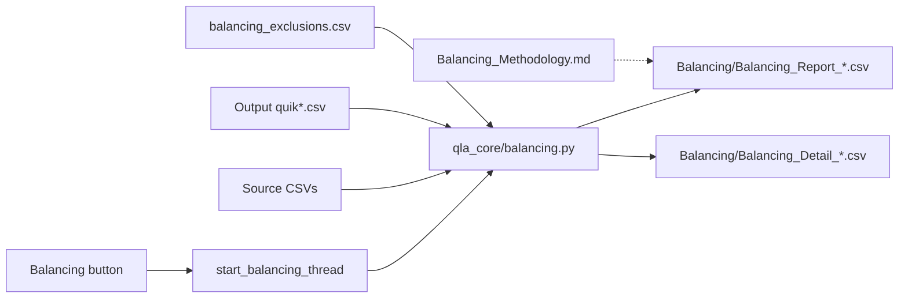

# Issue #87 — Planning Report

**Issue:** #87 — QuikForge Balancing feature — source-to-QLAdmin reconciliation report  
**Framework stage:** Planning Agent  
**Status:** Ready for Risk Review (pending Dependency Gate)  
**Generated:** 2026-07-19  
**Agent/script:** Planning Agent / Cursor Grok 4.5 (locked)  
**Code changes:** None  
**Design authority:** `Issue_87_Design_Proposal.md`

---

## 1. Executive Finding

Issue #87 is a **read-only QuikForge reporting enhancement**, not a mapping fix. All required LifePRO midyear extracts and matching `quik*` outputs already exist. The recommended build is a new `qla_core/balancing.py` module that resolves Source via `resolve_table_source`, reads Output CSVs from disk, computes ~15–20 fleet controls (counts + dollars + inventory), and writes one CSV report plus a static methodology companion under `QLA_Migration/Balancing/`. UI work is a surgical Operations-row button mirroring Governance Audit. **No Sync_Rulebook, conversion mapping, or schema changes.** Expected source↔output gaps (UV/FV/SL filters, CREDIT 110, loan zero-balance holds, etc.) must be wired as **EXPLAINED**, not FAIL. Ready for Risk once Dependency Gate clears.

---

## 2. Confirmed LifePRO Source Table/File(s)

Resolver: `qla_core/lifepro_source_resolver.py` — `resolve_table_source(src_dir, table_id)`. Newest match wins (midyear `*_20260630` preferred).

| Source table | File pattern (midyear) | In Source/? | ≈ Data rows |
|--------------|------------------------|:-----------:|------------:|
| PPOLC | `PPOLC_PolicyMaster_Extract_20260630.csv` | Yes | 5,084 |
| PPBEN | `PPBEN_PolicyBenefit_Extract_20260630.csv` | Yes | 11,699 |
| PPBENTYP | `PPBENTYP_BenefitType_Extract_20260630.csv` | Yes | 7,003 |
| RNA (PRELSA) | `RelationshipNameAddress_Extract_20260630.csv` | Yes | 46,980 |
| PACTG | `PACTG_Accounting_Extract20260630.csv` | Yes | 404,451 |
| PLOAN | `PLOAN_LoanInformation_Extract_20260630.csv` | Yes | 94,152 |

### Available source fields (balancing-relevant)

| Field | Column / source | Notes |
|-------|-----------------|-------|
| Policy number | `POLICY_NUMBER` | Crosswalk + #25 pad when comparing to `MPOLICY` |
| Modal premium | PPOLC `MODE_PREMIUM` | → `quikmstr.MMODEPREM` |
| Face components | PPBEN `NUMBER_OF_UNITS` × `VALUE_PER_UNIT` | → `MUNIT` × `MVPU` |
| Dividend accum | PPBENTYP `ACCUM_DIVIDENDS` | → `quikdvdp.MDEPOSIT` |
| Accounting amount | PACTG `TRANS_AMOUNT` | Premium vs dividend via **CREDIT/DEBIT code**, not TRANS_CODE |
| Premium filter | PACTG `CREDIT_CODE == "110"` | Matches `quikprmh` converter |
| Dividend txn filter | CREDIT/DEBIT in `{516, 0516}` | Matches `quikdvpr` converter |
| Loan balance | PLOAN `LOAN_BALANCE` | Latest per policy; zero-balance often held |
| RNA roles | `NAME_ID`, `RELATE_CODE`, `POLICY_NUMBER`, `CANCEL_DATE` | Clients / links / bens |

---

## 3. Confirmed QLAdmin Target Structure

Balancing **reads** these tables; it does not change their emit:

| Table | Field | Role in Balancing | Repo authority |
|-------|-------|-------------------|----------------|
| quikmstr | `MPOLICY`, `MMODEPREM` | Policy count; modal premium $ | `Sync_Rulebook_quikmstr.csv` L11 |
| quikridr | `MPOLICY`, `MUNIT`, `MVPU` | Rider count; face $ | `Sync_Rulebook_quikridr.csv` L14–15 |
| quikclnt | `MCLIENTID` | Distinct client count | RNA → clnt path |
| quikclid | `MPOLICY`, `MCLIENTID`, `MRELATION` | Relationship count | `Sync_Rulebook_quikclid.csv` |
| quikbenf | `MPOLICY`, `MSPLIT`, … | Ben count; split integrity | RNA B1/B2/P/C filter |
| quikprmh | `MPOLICY`, `PREMIUM` | Prem hist count + $ | Runtime CREDIT 110; rulebook L5 |
| quikloan | `MPOLICY`, `MLOANBAL` | Loan count + $ | `quikloan_converter` + derivation rules |
| quikdvdp | `MPOLICY`, `MDEPOSIT` | Dividend deposit $ | `Sync_Rulebook_quikdvdp.csv` L3 |
| quikdvpr | `MPOLICY`, `MDIV` | Dividend txn count + $ | `Sync_Rulebook_quikdvpr.csv` L4–5 |

**Current Output approximate row counts (midyear batch on disk):**

| File | ≈ Rows |
|------|-------:|
| quikmstr | 5,084 |
| quikridr | 6,936 |
| quikclnt | 13,532 |
| quikclid | 32,176 |
| quikbenf | 5,852 |
| quikprmh | 201,572 |
| quikloan | 365 |
| quikdvdp | 5,084 |
| quikdvpr | 28 |

**Repo references (population / UI only — do not alter for Balancing logic beyond read):**

| Location | Role |
|----------|------|
| `qla_core/lifepro_source_resolver.py` | Source resolve |
| `app.py` ~2774–2782 | Ops buttons (`primary_actions`) |
| `app.py` ~5763–5806 | Governance Audit thread pattern |
| `app.py` ~6117–6131, ~8103–8118 | Existing row-count audit |
| `qla_core/issue21_open_item_decisions.py` | Money-total staging pattern |
| `qla_core/quikloan_converter.py` ~527–591 | Loan control-total pattern |
| `qla_core/non_product_row_governance.py` | EXPLAINED exclusions |
| `.cursor/rules/qla-output-folder.mdc` | Balancing must not pollute Output |

---

## 4. Required Source-to-Target Field Mapping

This issue maps **controls**, not conversion fields. Conversion mappings stay as-is.

| Control ID | LifePRO side | QLAdmin side | Transformation | Change conversion? |
|------------|--------------|--------------|----------------|:------------------:|
| BAL-C01 | PPOLC row count | quikmstr row count | Direct | No |
| BAL-C02 | PPBEN convertible rows (exclude UV/FV/SL; seq rules) | quikridr rows | Mirror converter filter | No |
| BAL-C03 | RNA distinct active `NAME_ID` | quikclnt rows | Dedupe / cancel filter | No |
| BAL-C04 | RNA relationship rows (active) | quikclid rows | Mirror clid filter | No |
| BAL-C05 | RNA `RELATE_CODE ∈ {B1,B2,P,C}` | quikbenf rows | Mirror benf filter | No |
| BAL-C06 | PACTG CREDIT 110 (minus excluded codes) | quikprmh rows | Mirror prmh filter | No |
| BAL-C07 | PLOAN active/latest non-zero candidates | quikloan rows | Mirror loan emit rules | No |
| BAL-C08 | PACTG CREDIT/DEBIT 516 | quikdvpr rows | Mirror dvpr filter | No |
| BAL-D01 | Σ PPBEN units×VPU (convertible) | Σ ridr MUNIT×MVPU | Money | No |
| BAL-D02 | Σ PPOLC MODE_PREMIUM | Σ mstr MMODEPREM | Money | No |
| BAL-D03 | Σ PACTG TRANS_AMOUNT (CREDIT 110) | Σ prmh PREMIUM | Money | No |
| BAL-D04 | Σ latest PLOAN LOAN_BALANCE (emit set) | Σ loan MLOANBAL | Money | No |
| BAL-D05 | Σ PPBENTYP ACCUM_DIVIDENDS (emit grain) | Σ dvdp MDEPOSIT | Money | No |
| BAL-D06 | Σ PACTG TRANS_AMOUNT (516) | Σ dvpr MDIV | Money | No |
| BAL-D07 | — | Per-policy Σ benf MSPLIT ≈ 100 | Integrity | No |
| BAL-I01 | PPOLC policy set | quikmstr MPOLICY set | Set diff + exclusions | No |
| BAL-I02 | quikmstr MPOLICY set | Must ⊆ PPOLC (+crosswalk) | Invented-policy check | No |

### Fields / behaviors that must remain unchanged

| Target | Current source | Touch this issue? |
|--------|----------------|:-----------------:|
| quikmstr.MMODEPREM | PPOLC.MODE_PREMIUM | **No** |
| quikridr.MPREM | ANN_PREM_PER_UNIT + fallback (#26) | **No** |
| MPOLICY padding | `format_qladmin_mpolicy` (#25) | **No** (use when comparing keys) |
| All Sync_Rulebook_*.csv | — | **No** |
| Claims balancing | `claims_analysis/` | **No** |

---

## 5. Open Client / Conversion Questions

These are **soft** (owner: Conversion / Warren). Not extract blockers.

1. **Auto-run:** Button-only for v1, or also auto-run at end of Full Batch?  
   *Recommendation:* Button-only in first ship; optional auto-run as follow-up flag.  
2. **v1 control set:** Ship all BAL-C/D/I above, or start with C01–C02, D01–D02, I01–I02 only?  
   *Recommendation:* Ship full Tier 1–3 list above (~17 controls) — still one readable CSV.  
3. **EXPLAINED config ownership:** Seed from non-product governance + loan zero-balance + documented converter filters; any client-specific holds?  
   *Recommendation:* Start with converter-documented filters only; expand via `Configs/balancing_exclusions.csv`.  
4. **Source folder lock:** Use same UI Source folder as Full Batch / prompt like Governance Audit?  
   *Recommendation:* Mirror Governance Audit folder resolution.  
5. **Open Balancing folder button:** Add second ops button, or open folder at end of run only?  
   *Recommendation:* Open folder after successful run (messagebox path); optional Browse later.

---

## 6. Recommended Formatting Rules

| Rule | Recommendation |
|------|----------------|
| Policy key | Normalize via crosswalk + `format_qladmin_mpolicy` before set diffs (#25) |
| Money | Decimal compare to 2 places; variance = source − qla |
| Counts | Integer; variance = source − qla |
| Status | PASS if variance = 0 (or within $0.01); EXPLAINED if variance matches exclusion ledger; else FAIL |
| Blanks / zeros | Treat blank money as 0; loan zero-balance held = EXPLAINED not FAIL |
| Report location | `QLA_Migration/Balancing/` only — never Output root |
| Timestamps | `YYYYMMDD_HHMMSS` in report filenames |

---

## 7. Memo / Text / Special Handling

N/A for Balancing core. Methodology.md is static prose (Markdown), not MEMOTEXT.

---

## 8. Policy Number Key Handling

1. LifePRO `POLICY_NUMBER` → `Master_Crosswalk.csv` → QLA key  
2. Apply `format_qladmin_mpolicy()` for CHARACTER(10) compare  
3. Inventory FAIL detail lists padded MPOLICY + LP key + reason  
4. Orphans in Output without Source → FAIL (invented) unless exclusion documents them  

---

## 9. Estimated Record Counts

| Metric | Count | Basis |
|--------|------:|-------|
| Policies (PPOLC ≈ quikmstr) | ~5,084 | Midyear extract / output |
| PPBEN raw → ridr | 11,699 → 6,936 | Expected filter gap (EXPLAINED) |
| PACTG → prmh | ~404k → ~202k | CREDIT 110 + filters |
| PLOAN → quikloan | ~94k → ~365 | Latest non-zero emit |
| Controls in report | ~17 | Design + this plan |
| Conversion rows changed by this issue | **0** | Read-only |

---

## 10. Sample Trace (fleet sanity — not policy UAT)

Fleet feature; sample of **expected EXPLAINED gaps** (before-state measurable today):

| Control | Source approx | QLA approx | Expected status |
|---------|--------------:|-----------:|-----------------|
| Policies | 5,084 | 5,084 | PASS (or tiny EXPLAINED) |
| Riders | 11,699 raw | 6,936 | EXPLAINED (UV/FV/SL + seq) |
| Prem hist rows | ~207k CREDIT 110 | ~202k | EXPLAINED / investigate residual |
| Loans | ~94k hist | 365 | EXPLAINED (latest non-zero) |
| Div txns | ~30 DEBIT 516 | 28 | Near-PASS / EXPLAINED |

Detailed policy-level FAIL samples are a **Development + Validation** deliverable when a control fails.

---

## 11. Risks and Unknowns

| Risk | Severity | Mitigation |
|------|----------|------------|
| Naive row counts mark known filters as FAIL | High (noise) | Mirror converter filters; EXPLAINED ledger |
| Money float drift | Medium | Round to cents; $0.01 tolerance |
| Wrong PACTG discriminator (TRANS_CODE doesn't exist) | High if wrong | Use CREDIT/DEBIT 110 / 516 only |
| Confusing with claims balancing | Medium | Separate folder + methodology disclaimer |
| UI / batch coupling slows Full Batch | Low | Button-only v1 |
| Output hygiene violation | Medium | Write only under `Balancing/` |
| Large PACTG scan time | Low–Med | Stream CSV; progress bar like Governance |

---

## 12. Dependency Gate Preview

| Check | Met? |
|-------|:----:|
| Source files present | Yes |
| Output files present for before-state | Yes |
| Field definitions confirmed | Yes (rulebooks + converters) |
| Client scope clear | Yes (internal design proposal) |
| Example policies | N/A (fleet) — waived |

---

## 13. Recommended Risk Agent Prompt

```
Proceed to Risk Agent for Issue 87.

Read AI_Agents/Risk_Agent.md and AI_Agents/Templates/Risk_Report_Template.md.
Model: Cursor Grok 4.5 (locked). Do not code.

Produce before/after impact analysis and go/no-go recommendation for:
- New qla_core/balancing.py (read-only Source/Output reconciliation)
- Surgical QuikForge UI button (mirror Governance Audit thread pattern)
- New QLA_Migration/Balancing/ report folder + Balancing_Methodology.md
- Configs/balancing_exclusions.csv for EXPLAINED variances
- Version bump both app.py copies (from v58.13)

Confirm blast radius: zero conversion mapping/schema changes; no Sync_Rulebook edits;
preserve Issue #25 MPOLICY padding and Issue #26 MPREM mapping.
Address soft decisions Q1–Q5 in Planning §5 (recommend defaults if still open).
```

---

## 14. Recommended Development Task (Do Not Implement)

1. Create `QLA_Migration/Balancing/` and seed `Balancing_Methodology.md` (static control definitions).  
2. Add `QLA_Migration/Configs/balancing_exclusions.csv` (control → reason → population rule).  
3. Implement `qla_core/balancing.py`: resolve sources, read outputs, compute BAL-C/D/I controls, write `Balancing_Report_<ts>.csv` + FAIL detail CSVs.  
4. Surgical `app.py` + `QLA_Migration/app.py`: Ops button + `start_balancing_thread` / `_run_balancing_ui`; bump `APP_VERSION` both copies.  
5. Optional: post-batch hook behind flag (default off for v1).  
6. Validation script: `Issue_Log_Items/Issue_87/scripts/validate_issue87_balancing.py` — report schema, ≥1 PASS/EXPLAINED row, folder hygiene (no Balancing files in Output).  
7. Do **not** modify Sync_Rulebook_*.csv or converter money mappings.

**Version bump:** next patch after Risk approval (e.g. v58.14 — Risk confirms).

---

## Appendix

### Architecture sketch



### Related issues

- #25 MPOLICY padding — preserve in key compares  
- #26 MPREM — do not touch  
- #21G — related money staging pattern only  
- #38 — dividend deposit authority (MDEPOSIT) — Balancing reads result, does not change emit  
- Claims phases — out of scope  

### References

- `Issue_87_Design_Proposal.md`  
- `qla_core/lifepro_source_resolver.py`  
- `plan_governance/non_product_row_governance_rule.md`  
- `plan_governance/config/quikloan_derivation_rules.json`  
- `QLA_Migration/Configs/Sync_Rulebook_quik{mstr,ridr,prmh,dvdp,dvpr,clid}.csv`  
- `.cursor/rules/qla-output-folder.mdc`  
- `AGENTS.md`
