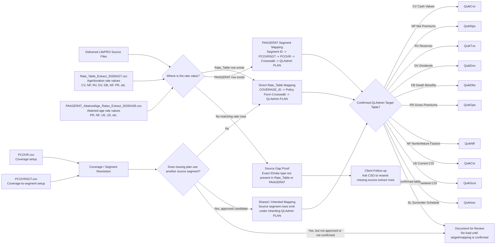

# LifePRO to QLAdmin Rate Mapping Flow

Meeting artifact for explaining how delivered LifePRO rate data is mapped, loaded, inherited/shared, or documented as unavailable.

## Executive Summary

Every LifePRO rate follows one of three paths:

1. Loaded directly from the delivered rate extract.
2. Loaded through an approved shared/inherited segment relationship.
3. Documented as not loadable yet because the source row is missing, the QLAdmin destination is not confirmed, or the segmentation does not fit the confirmed QLAdmin rules.

The converter does not invent rates. A rate value must exist in `Rate_Table_Extract_20260427.csv` or `PAAGERAT_AttainedAge_Rates_Extract_20260428.csv`.

## Rate Mapping Flow Chart

## Source Files and Their Role

- `Rate_Table_Extract_20260427.csv`: LifePRO age/duration rate-value extract. This is the main source for `CV`, `NP`, `RV`, `DV`, `DB`, `NF`, and other duration-based rate rows.
- `PAAGERAT_AttainedAge_Rates_Extract_20260428.csv`: LifePRO attained-age rate-value extract. This is the source for attained-age rows such as `PR` gross premiums, `NF` nonforfeiture factors, `U6` current COI, and `U5` guaranteed COI where enabled.
- `PCOVR.csv`: LifePRO coverage setup. This helps confirm whether a coverage ID exists as a product/coverage row.
- `PCOVRSGT.csv`: LifePRO coverage-to-segment setup. This shows when one product points to another segment. It can prove a relationship exists, but it does not contain the actual rate values.
- `Policy Form Crosswalk 5.22.26.xlsx`: maps LifePRO `COVERAGE_ID` values to QLAdmin `PLAN` codes.

## Confirmed QLAdmin Rate Destinations

| LifePRO Type | Plain-English Meaning | Source Extract | QLAdmin Target Table | Current Handling |
|---|---|---|---|---|
| `CV` | Cash values | `Rate_Table` | `QuikCvs` | Direct plus Issue #40 CV inheritance |
| `NP` | Net premiums | `Rate_Table` | `QuikNps` | Direct plus approved shared candidates |
| `RV` | Reserve factors | `Rate_Table` | `QuikTvs` | Direct plus approved shared candidates |
| `DV` | Dividends | `Rate_Table` | `QuikDvs` | Direct plus approved shared candidates |
| `DB` | Death benefits | `Rate_Table` | `QuikDbs` | Direct plus approved shared candidates |
| `PR` | Gross premiums | `Rate_Table` / `PAAGERAT` | `QuikGps` | Direct PAAGERAT plus approved shared candidates |
| `NF` | Nonforfeiture factors | `Rate_Table` / `PAAGERAT` | `QuikNff` | Direct plus approved shared candidates |
| `U6` | Current COI | `PAAGERAT` | `QuikCoi` | Enabled for confirmed ISWL plans |
| `U5` | Guaranteed COI | `PAAGERAT` | `QuikGcoi` | Enabled for confirmed ISWL plans |
| `SL` | Surrender charge schedule | `Rate_Table` | `QuikIssc` | Enabled through ISWL schedule loader |

## Shared / Inherited Segment Examples

The shared-loader path is manifest-gated. That means we only load an inherited/shared rate when the candidate is explicitly listed in:

`Issue_Log_Items/Issue_Rates_Inheritance_Validation/master_rate_completeness/approved_shared_rate_candidates.csv`

Examples of shared segment owners identified in the rate-completeness work include:

- `659 CEN II`
- `L14`
- `SAL OL`
- `L10 LP95`
- `670 GL85-8`
- PUA source segments such as `961 ME65`, `665 STME95`, and `980 END65`

The source segment supplies the rate value. The inheriting QLAdmin plan receives the output row.

## Current Shared Loader Results

- Shared manifest entries: `43`
- Shared rows emitted: `137,641`
- Shared output key collisions: `0`
- Shared rows not emitted pending segmentation review: `3,872`

Detailed evidence:

- `shared_rate_candidate_emit_summary.csv`
- `shared_rate_candidate_non_emitted_rows.csv`
- `shared_rate_candidate_implementation_report.md`

## Exception and Proof Path

If a client screenshot shows a rate but the delivered extract does not contain the row, the converter cannot load it. We prove that by searching:

1. Exact `COVERAGE_ID` in `Rate_Table`.
2. Exact `COVERAGE_ID` plus exact `TYPE_CODE` where required.
3. Exact `COVERAGE_ID` in `PAAGERAT`.
4. Exact coverage setup in `PCOVR`.
5. Segment/setup references in `PCOVRSGT`.
6. Raw byte occurrences of the ID in the delivered files.

Known screenshot-only source gaps:

- `L01 10Y` `NP`: screenshots show the rate, but delivered `Rate_Table` and `PAAGERAT` extracts do not contain exact `L01 10Y` `NP` rows.
- `L10 LP9595`: LifePRO setup references the ID, but delivered `Rate_Table` and `PAAGERAT` extracts contain no exact `L10 LP9595` rate rows.

## Meeting Message

The rate load is now being managed as a completeness process, not just a converter process. For every source row we have, we either load it to the confirmed QLAdmin rate table, load it through an approved shared segment relationship, or document exactly why it cannot be loaded yet.
